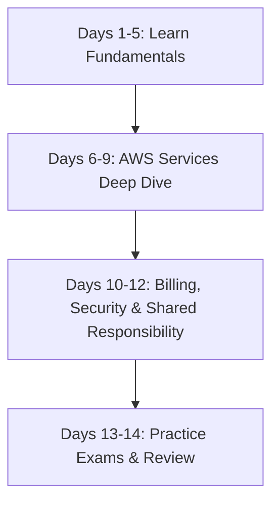

# Beginner's Guide: ML Frameworks & AWS Cloud Practitioner

This guide is designed to help you quickly build familiarity with the core Machine Learning frameworks (**scikit-learn**, **PyTorch**, and **TensorFlow**) and kickstart your preparation for the **AWS Certified Cloud Practitioner (CLF-C02)** exam.

---

## Part 1: Machine Learning Frameworks Demystified

If a job description asks for familiarity with these three frameworks, you don't need to be an expert in all of them immediately. You need to understand their **primary use cases**, **how their syntax looks**, and **how to build a basic model** in each.

### Summary Comparison

| Feature | scikit-learn | PyTorch | TensorFlow / Keras |
| :--- | :--- | :--- | :--- |
| **Primary Use Case** | Classical ML (Regression, Trees, SVMs) | Deep Learning / Neural Networks, Research | Deep Learning, Production Deployments |
| **Data Structure** | NumPy Arrays, Pandas DataFrames | PyTorch Tensors (`torch.Tensor`) | TensorFlow Tensors (`tf.Tensor`) |
| **API Style** | High-level, simple `fit()` / `predict()` | Object-Oriented, explicit, Pythonic | High-level (via Keras) or low-level |
| **Training Loop** | Hidden (handled internally in `fit()`) | Explicit (you write the `for` loop) | Hidden (via `model.fit()`) |
| **Difficulty** | Very Easy | Medium (requires understanding math flows) | Easy (Keras) to Medium (low-level) |

---

### 1. scikit-learn: The Starting Point
Use scikit-learn for tabular data (spreadsheets, databases) and standard algorithms like Linear Regression, Decision Trees, Random Forests, and K-Means.

#### Core Concept: The `Estimator` API
Almost every model in scikit-learn follows the exact same pattern:
1. **Initialize**: `model = RandomForestClassifier()`
2. **Train**: `model.fit(X_train, y_train)`
3. **Predict**: `predictions = model.predict(X_test)`

#### Beginner Code Example: Classification on Iris Dataset
```python
from sklearn.datasets import load_iris
from sklearn.model_selection import train_test_split
from sklearn.ensemble import RandomForestClassifier
from sklearn.metrics import accuracy_score

# 1. Load sample dataset (Iris flower dataset)
data = load_iris()
X, y = data.data, data.target

# 2. Split data into training (80%) and testing (20%) sets
X_train, X_test, y_train, y_test = train_test_split(X, y, test_size=0.2, random_state=42)

# 3. Initialize the model
model = RandomForestClassifier(n_estimators=100, random_state=42)

# 4. Train the model
model.fit(X_train, y_train)

# 5. Predict and evaluate
predictions = model.predict(X_test)
accuracy = accuracy_score(y_test, predictions)

print(f"scikit-learn Model Accuracy: {accuracy * 100:.2f}%")
```

---

### 2. PyTorch: The Deep Learning Standard
PyTorch is currently the most popular framework for Deep Learning research and modern Generative AI. It treats everything as a **Tensor** (a multi-dimensional array similar to a NumPy array, but capable of running on a GPU).

#### Core Concept: The Custom Training Loop
Unlike scikit-learn, PyTorch does not hide the training loop. You must explicitly write code to:
1. Pass data forward through the network (Forward Pass).
2. Calculate the loss (how wrong the model is).
3. Backpropagate the error (Backward Pass).
4. Update the model weights (Optimization).

#### Beginner Code Example: Linear Regression in PyTorch
```python
import torch
import torch.nn as nn
import torch.optim as optim

# 1. Prepare dummy data (y = 2x + 1)
# Tensors must be floats for training
X = torch.tensor([[1.0], [2.0], [3.0], [4.0]], dtype=torch.float32)
y = torch.tensor([[3.0], [5.0], [7.0], [9.0]], dtype=torch.float32)

# 2. Define a simple linear model (1 input feature -> 1 output feature)
model = nn.Linear(in_features=1, out_features=1)

# 3. Define Loss Function (Mean Squared Error) and Optimizer (Stochastic Gradient Descent)
criterion = nn.MSELoss()
optimizer = optim.SGD(model.parameters(), lr=0.01)

# 4. Explicit Training Loop
for epoch in range(100):
    # Forward Pass: Predict outputs
    predictions = model(X)
    
    # Calculate Loss
    loss = criterion(predictions, y)
    
    # Backward Pass: Zero gradients, calculate new gradients, update weights
    optimizer.zero_grad()
    loss.backward()
    optimizer.step()
    
    if (epoch + 1) % 20 == 0:
        print(f"Epoch [{epoch+1}/100], Loss: {loss.item():.4f}")

# 5. Test the model
test_val = torch.tensor([[5.0]], dtype=torch.float32)
predicted_val = model(test_val)
print(f"PyTorch prediction for x=5: {predicted_val.item():.4f} (Expected: ~11.0)")
```

---

### 3. TensorFlow (Keras): High-Level Deep Learning
TensorFlow is built by Google. The primary way beginners interface with TensorFlow is through **Keras**, a high-level API designed to make building neural networks as easy as stacking blocks.

#### Core Concept: Sequential API
You define a model by adding sequential layers, compiling it with a loss function and optimizer, and running `fit()`.

#### Beginner Code Example: Simple Neural Network
```python
import tensorflow as tf
from tensorflow.keras import layers, models
import numpy as np

# 1. Prepare dummy data (y = 2x + 1)
X = np.array([[1.0], [2.0], [3.0], [4.0]], dtype=float)
y = np.array([[3.0], [5.0], [7.0], [9.0]], dtype=float)

# 2. Define the model architecture using Keras Sequential
model = models.Sequential([
    layers.Dense(units=1, input_shape=[1]) # 1 layer, 1 neuron
])

# 3. Compile the model
model.compile(optimizer='sgd', loss='mean_squared_error')

# 4. Train the model (hidden loop)
model.fit(X, y, epochs=100, verbose=0) # verbose=0 silences output logs

# 5. Predict
test_val = np.array([[5.0]])
predicted_val = model.predict(test_val)
print(f"TensorFlow prediction for x=5: {predicted_val[0][0]:.4f} (Expected: ~11.0)")
```

---

## Part 2: AWS Certified Cloud Practitioner (CLF-C02) Prep

The AWS Certified Cloud Practitioner is the baseline certification for AWS. It tests your high-level understanding of cloud concepts, security, billing, and core services. It does **not** require you to write code or configure complex networks.

### 1. Key Concepts to Master

> [!IMPORTANT]
> The exam does not expect deep technical CLI commands. It expects you to match a business scenario or requirement with the correct AWS service or concept.

*   **The Shared Responsibility Model**: Memorize what AWS is responsible for (Security **of** the cloud: physical security, hardware, global infrastructure) versus what the customer is responsible for (Security **in** the cloud: customer data, IAM user configuration, operating systems).
*   **The AWS Well-Architected Framework**: Understand the 6 Pillars:
    1. Operational Excellence
    2. Security
    3. Reliability
    4. Performance Efficiency
    5. Cost Optimization
    6. Sustainability
*   **Cloud Benefits**: Understand Elasticity (scaling resources up/down automatically), Agility (fast deployment), and High Availability (minimal downtime).

### 2. Must-Know Core AWS Services

You will see questions asking: *"Which service should a company use to...?"* Use this cheat sheet:

| Service Category | Service Name | Purpose (Cheat Sheet Keywords) |
| :--- | :--- | :--- |
| **Compute** | **EC2** (Elastic Compute Cloud) | Virtual servers in the cloud. Pay by the hour/second. |
| | **Lambda** | Serverless compute. Run code only when triggered. Pay per execution. |
| | **ECS / EKS** | Running Docker containers in AWS. |
| **Storage** | **S3** (Simple Storage Service) | Object storage (files, images, backups). Unlimited storage capacity. |
| | **EBS** (Elastic Block Store) | Virtual hard drives attached to EC2 instances. |
| **Database** | **RDS** (Relational Database Service)| Managed SQL databases (PostgreSQL, MySQL, Oracle). |
| | **DynamoDB** | Managed NoSQL key-value database (extremely fast, serverless). |
| **Networking** | **VPC** (Virtual Private Cloud) | Your isolated private network inside AWS. |
| | **Route 53** | Amazon's Domain Name System (DNS) service. |
| **Security** | **IAM** (Identity & Access Management) | Users, Groups, Roles, Policies. Who can access what. |
| | **Security Groups** | Virtual firewalls controlling traffic for EC2 instances. |
| | **AWS Shield** | Protection against Distributed Denial of Service (DDoS) attacks. |
| **Management** | **CloudWatch** | Monitor resources, metrics, logs, and set alarms. |
| | **CloudTrail** | Audit user activity and API calls (who did what in your account). |
| **Billing** | **Cost Explorer** | Visualize and analyze your past and current AWS costs. |
| | **AWS Budgets** | Set custom budgets and receive alerts if costs exceed limits. |

---

### 3. Study Strategy for Beginners (14-Day Roadmap)



#### **Phase 1: Free Video Course (Days 1–5)**
Do not pay for expensive courses. AWS provides official free training, and excellent high-quality courses are available on YouTube:
*   **AWS Cloud Practitioner Essentials** (Free course on [AWS Skill Builder](https://aws.amazon.com/training/digital/aws-cloud-practitioner-essentials/)).
*   **freeCodeCamp's AWS Certified Cloud Practitioner Course** on YouTube (usually 10-15 hours long, highly recommended for visual learners).

#### **Phase 2: Hands-On in the Free Tier (Days 6–9)**
Create a free AWS account.
*   **Crucial First Step**: Set up Multi-Factor Authentication (MFA) on your Root Account, and configure an **AWS Budget** for $1 to alert you of any accidental charges.
*   Launch a free-tier micro EC2 instance, log into it, and terminate it.
*   Create an S3 bucket, upload an image, change its settings, and delete it.

#### **Phase 3: Deep Dive into Exam Topics (Days 10–12)**
*   Focus on **Support Plans** (Basic vs. Developer vs. Business vs. Enterprise).
*   Understand the **AWS Pricing Models** (On-Demand, Reserved Instances, Savings Plans, Spot Instances). Spot is cheapest (interruptible), Reserved is for stable workloads (1-3 year commitment).

#### **Phase 4: Practice Exams (Days 13–14)**
*   Taking practice exams is the **most important** step to passing. They teach you how questions are phrased.
*   Search for practice questions online or use platforms like Udemy (e.g., practice tests by Stephane Maarek or Jon Bonso).
*   Review every question you got wrong and read the explanation.

---

## Part 3: Where ML & AWS Meet

In modern roles, you will deploy your scikit-learn, PyTorch, or TensorFlow models onto AWS.

1.  **Amazon SageMaker**: The ultimate service for ML. It allows you to build, train, and deploy models (using PyTorch, scikit-learn, or TensorFlow) without worrying about setting up servers.
2.  **Amazon Bedrock**: A serverless service to access pre-trained Foundation Models (like Claude or Llama) using simple APIs (Generative AI/RAG).
3.  **EC2 for ML**: Sometimes, you manually lease a GPU-enabled EC2 instance (like the `g4dn` or `g5` families), install PyTorch, and run training yourself.
