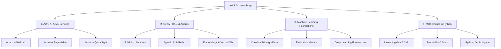
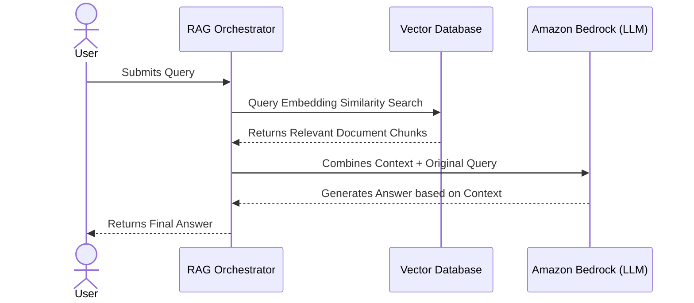

# AWS AI Intern Interview Preparation Guide

This guide is customized for your upcoming interview for the **AWS AI Intern** role at **Royal Cyber**. It covers the essential technical domains, core AI/ML concepts, mathematics, and AWS services listed in the job description, along with practical study guides and mock questions.

---

## 🏢 Company Profile: Royal Cyber
* **About**: Royal Cyber is an IT consulting and enterprise solutions provider specializing in digital transformation, cloud technologies, AI/ML, and e-commerce.
* **Core Domains**: Cloud migrations, GenAI integrations, DevSecOps, and Big Data.
* **Their Need**: They are looking for an intern to work on cutting-edge generative AI, foundation models (Amazon Bedrock), traditional ML (SageMaker), and BI integrations (QuickSight/QuickSuite).

---

## 🗺️ Preparation Roadmap & Core Technical Areas



---

## ☁️ 1. AWS AI & ML Services

### Amazon Bedrock
Amazon Bedrock is a fully managed service that offers key Foundation Models (FMs) from leading AI companies (Anthropic, Meta, Cohere, AI21, Stability AI, and Amazon) via a unified API.

* **Key Features**:
  * **Serverless**: No infrastructure to manage.
  * **Model Customization**: Supports fine-tuning and retrieval-augmented generation (RAG) with Knowledge Bases.
  * **Guardrails for Bedrock**: Used to filter toxic content, PII, and define custom safety boundaries.
* **API Usage Example (Python)**:
  ```python
  import boto3
  import json

  # Initialize the Bedrock Runtime client
  bedrock_runtime = boto3.client(service_name="bedrock-runtime", region_name="us-east-1")

  # Define the request payload (example for Anthropic Claude 3 Sonnet)
  prompt_config = {
      "anthropic_version": "bedrock-2023-05-31",
      "max_tokens": 500,
      "messages": [
          {
              "role": "user",
              "content": "Explain Retrieval-Augmented Generation in one sentence."
          }
      ]
  }

  response = bedrock_runtime.invoke_model(
      modelId="anthropic.claude-3-sonnet-20240229-v1:0",
      body=json.dumps(prompt_config)
  )

  response_body = json.loads(response.get("body").read())
  print(response_body['content'][0]['text'])
  ```

### Amazon SageMaker
SageMaker is an end-to-end service for building, training, and deploying machine learning models.

* **Core Components**:
  * **SageMaker Studio**: A unified web-based IDE for machine learning.
  * **SageMaker Notebooks**: Managed Jupyter environments.
  * **SageMaker Pipelines**: CI/CD workflows for machine learning.
  * **SageMaker JumpStart**: A hub for pre-trained models and solutions.
* **Workflow**:
  1. **Prepare**: SageMaker Data Wrangler / Feature Store.
  2. **Build**: Notebooks, built-in algorithms (XGBoost, Linear Learner).
  3. **Train**: Distributed training instances, hyperparameter tuning.
  4. **Deploy**: Real-time endpoints, batch transform, or serverless inference.

### Amazon QuickSight (QuickSuite)
* **What it is**: QuickSight is a cloud-scaled business intelligence (BI) service.
* **Integration**: QuickSight Q uses ML/natural language queries to let business users ask questions about their data. As an AI intern, you might build pipelines that expose data or use Bedrock to feed insights into QuickSight dashboards.

---

## 🤖 2. Generative AI: RAG & Agentic Architectures

### Retrieval-Augmented Generation (RAG)
RAG addresses the limitations of Large Language Models (LLMs) like knowledge cutoff dates and hallucinations by combining retrieval models with generative models.



* **Core Pipeline**:
  1. **Document Ingestion**: Document -> Text Splitting -> Vector Embedding (using models like Amazon Titan Multimodal Embeddings or Cohere Embed) -> Vector Store (Amazon OpenSearch, PGVector, Pinecone).
  2. **Querying**: Query -> Vector Embedding -> Cosine Similarity Search -> Top-$K$ document retrieval.
  3. **Generation**: Prompt Template + Retrieved Chunks + User Query -> LLM -> Response.

### Agentic AI Systems
Agentic AI refers to systems where LLMs act as central controllers/decision-makers that plan, use tools, and call external APIs to achieve a goal.

* **ReAct Framework (Reasoning + Acting)**:
  * **Thought**: "I need to find the current stock price of Apple. I don't have this in my static training data."
  * **Action**: `Search[Apple stock price today]`
  * **Observation**: "$182.40"
  * **Thought**: "I have the info. I can now answer the user."
* **State Management & Memory**: Implementing chat memory (short-term/long-term) using databases or Redis, orchestrating steps with frameworks like **LangChain** or **LangGraph**.

---

## 📐 3. Mathematics & ML Foundations

### Core Mathematics

#### 1. Linear Algebra
* **Vectors and Matrices**: Matrix multiplication is the foundational operation for neural networks and embeddings.
* **Cosine Similarity**: Measures the cosine of the angle between two multi-dimensional vectors. Used to find document similarity in RAG:
  $$\text{Similarity}(\mathbf{A}, \mathbf{B}) = \frac{\mathbf{A} \cdot \mathbf{B}}{\|\mathbf{A}\| \|\mathbf{B}\|} = \frac{\sum_{i=1}^{n} A_i B_i}{\sqrt{\sum_{i=1}^{n} A_i^2} \sqrt{\sum_{i=1}^{n} B_i^2}}$$
* **Eigenvalues & Eigenvectors**: Used in Principal Component Analysis (PCA) for dimensionality reduction.

#### 2. Calculus
* **Gradient Descent**: Optimization algorithm used to minimize loss functions.
  $$\theta_{t+1} = \theta_t - \eta \nabla L(\theta_t)$$
  where $\theta$ represents parameters, $\eta$ is the learning rate, and $\nabla L$ is the gradient of the loss function.
* **Partial Derivatives & Chain Rule**: Used to calculate gradients during the backpropagation step in neural networks.

#### 3. Probability & Statistics
* **Bayes' Theorem**: Fundamental to classification models like Naive Bayes.
  $$P(A|B) = \frac{P(B|A)P(A)}{P(B)}$$
* **Distributions**: Normal, Binomial, and Poisson distributions; understanding mean, variance, standard deviation, and Central Limit Theorem.

### Machine Learning Basics
* **Supervised Learning**: Linear Regression, Logistic Regression, Decision Trees, Support Vector Machines (SVMs), Random Forest, XGBoost.
* **Unsupervised Learning**: K-Means clustering, PCA, Hierarchical Clustering.
* **Bias-Variance Tradeoff**:
  * **High Bias**: Underfitting (model is too simple).
  * **High Variance**: Overfitting (model fits noise in training data).
* **Evaluation Metrics**:
  * Classification: Accuracy, Precision, Recall, F1-Score, ROC-AUC.
  * Regression: MSE, RMSE, MAE, $R^2$.
  * GenAI/RAG: ROUGE, BLEU, Context Relevance, Groundedness.

---

## 💻 4. Coding & Tools (Python, Git, Jupyter)

### Python Core Libraries
* **Pandas & NumPy**: Data cleaning, manipulation, and numerical arrays.
* **Scikit-Learn**: Splitting datasets, running standard models, and calculating metrics.
* **PyTorch / TensorFlow**: Deep learning, forward/backward pass, custom tensor shapes.

### Git & Jupyter Best Practices
* **Jupyter Notebooks**: Keep cells modular, clear output variables, and use descriptive headings.
* **Git Workflow**: Commits, branches, resolving merge conflicts, and writing clean pull requests.

---

## 🎯 Mock Interview Questions & Answers

### GenAI & AWS (Bedrock & SageMaker)

> [!NOTE]
> **Q1: What is Amazon Bedrock and how does it differ from Amazon SageMaker?**
> * **Answer**: Amazon Bedrock is a serverless, API-driven service designed for leveraging pre-trained foundation models (like Claude, Llama, Titan) directly. It is geared towards Generative AI applications where you do not want to manage hardware or train a model from scratch. Amazon SageMaker, on the other hand, is an end-to-end ML platform where you build, train, deploy, and monitor your own custom models (both traditional ML and custom deep learning models). You have full control over the training infrastructure and code in SageMaker.

> [!NOTE]
> **Q2: Explain how RAG works. What are the metrics you would use to evaluate a RAG pipeline?**
> * **Answer**: RAG is a technique where an LLM is paired with an external database containing proprietary data. When a query is made, we use an embedding model to vectorize the query, do a similarity search in a vector database, pull the top matching paragraphs, inject them as context into the prompt, and feed it to the LLM to generate an answer.
> To evaluate RAG, we use the **RAG Triad**:
> 1. **Context Relevance**: Did our search retrieve relevant text?
> 2. **Groundedness / Faithfulness**: Is the LLM's response fully derived from the retrieved context (no hallucinations)?
> 3. **Answer Relevance**: Does the final response actually answer the user's question?

> [!NOTE]
> **Q3: What are Agentic AI systems and how do they use "tools"?**
> * **Answer**: Agentic AI refers to an LLM loop that acts as an agent that can plan, reason, and take action. Instead of a single response, the agent decomposes a complex goal into smaller steps. It is equipped with "tools" (which are Python functions, web APIs, or calculators) defined with clear descriptions. The agent decides when and how to call these tools based on user inputs, processes the tool's output, and updates its plan iteratively.

### ML & Math Foundations

> [!NOTE]
> **Q4: What is the difference between L1 and L2 regularization?**
> * **Answer**: Both are techniques to prevent overfitting:
> * **L1 Regularization (Lasso)** adds the absolute values of the coefficients to the loss function ($L1 = \lambda \sum |w_i|$). It leads to sparse feature selection by driving some coefficients to exactly zero.
> * **L2 Regularization (Ridge)** adds the squared values of the coefficients to the loss function ($L2 = \lambda \sum w_i^2$). It shrinks all coefficients towards zero but keeps them non-zero, making the model more robust to multicollinearity.

> [!NOTE]
> **Q5: What is the gradient vanishing problem in deep learning and how is it solved?**
> * **Answer**: The vanishing gradient problem occurs during backpropagation when gradients decrease exponentially as they propagate backward through early layers, preventing weights from updating. This is common when using activation functions like Sigmoid or Tanh, whose derivatives are capped at small values ($<0.25$ for sigmoid).
> * **Solutions**: Using ReLU or Leaky ReLU activations, implementing Residual Connections (like in ResNets), applying Batch Normalization, or using specialized architectures like LSTMs/Transformers.

---

## 📝 Study Action Checklist

- [ ] **Bedrock API**: Familiarize yourself with the `boto3` Bedrock API structure (invoking models, passing parameters like temperature, max tokens).
- [ ] **LangChain / LlamaIndex**: Implement a simple, local RAG pipeline using a Jupyter Notebook and explain it clearly.
- [ ] **AWS Basics**: Learn the purpose of S3, IAM, SageMaker, OpenSearch, and Bedrock.
- [ ] **Basic math formulas**: Review Cosine Similarity, Gradient Descent updates, and Bayes' Theorem.
- [ ] **Explain your projects**: Prepare a 2-minute elevator pitch for 1-2 AI/ML projects you've worked on, emphasizing *why* you chose the model and *how* you evaluated it.

---
*Good luck with your interview preparation! You can use this document to track your progress and review these core concepts daily.*
