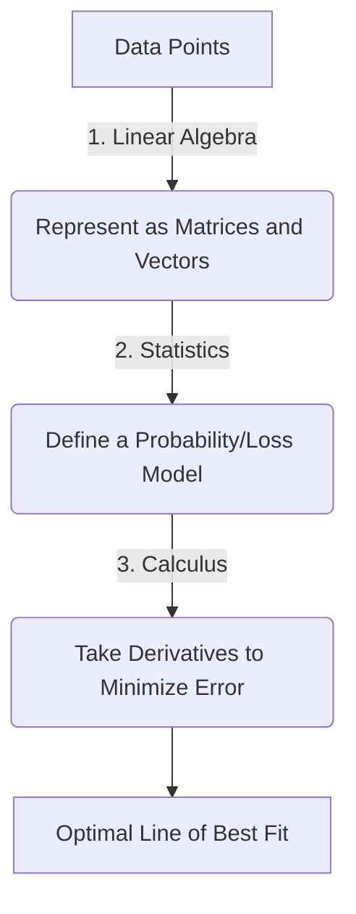

# The Master Foundation: Linear Algebra, Calculus, and Statistics

This guide is designed to take you from a complete beginner to a highly proficient, intuitive thinker in the three pillars of modern engineering, data science, and artificial intelligence: **Linear Algebra**, **Calculus**, and **Statistics & Probability**.

To become truly "unbeatable," you must not just memorize formulas but develop **spatial and physical intuition** for what the math is doing.

---

## 🗺️ The Unifying Blueprint: How They Connect

Before diving into each subject, let us look at a simple example that uses all three: **Linear Regression** (fitting a line to data points).



1. **Linear Algebra** is used to represent the data: we stack our data points into a matrix \(X\) and our targets into a vector \(y\).
2. **Statistics** is used to formulate the goal: we assume the data has some random noise and define a loss function (like Mean Squared Error) to measure how off our model is.
3. **Calculus** is used to solve it: we take the derivative (gradient) of the loss function with respect to our model's weights and set it to zero (or step downhill using Gradient Descent) to find the absolute best-fitting line.

---

## 📐 Part 1: Linear Algebra (The Language of Dimensions)

Linear algebra is the study of vectors and linear functions. In modern computing, everything (images, text, audio, user profiles) is converted into lists of numbers (vectors) and manipulated.

### 1. Vector Intuition
*   **What it is:** A vector can be viewed in three ways:
    *   *Computer Science:* A list of numbers (e.g., `[price, bedrooms, bathrooms]`).
    *   *Physics:* An arrow pointing in space, characterized by a **length (magnitude)** and a **direction**.
    *   *Math:* An object that can be added to another vector or scaled by a number.
*   **Key Operations:**
    *   **Vector Addition:** Combining two movements. If you walk 3 steps East and 2 steps North, then add a walk of 1 step West and 4 steps North, your net movement is vector addition.
    *   **Scalar Multiplication:** Scaling (stretching or shrinking) a vector. Scaling a vector \(\vec{v}\) by 2 doubles its length without changing its direction.

### 2. Linear Transformations & Matrices
*   **What is a Matrix?** A grid of numbers. But conceptually, **a matrix is a machine that transforms space**. It takes in a vector, moves it, and spits out a new vector: 
    \[ A\vec{x} = \vec{y} \]
*   **The Columns of a Matrix:** The columns of a matrix tell you *where the basis vectors land* after the transformation. 
    > [!TIP]
    > If you want to know what a matrix does to space, look at what it does to the standard basis vectors \(\hat{i} = [1, 0]^T\) and \(\hat{j} = [0, 1]^T\). Wherever they land forms the columns of your matrix.
*   **Matrix Multiplication:** This represents **composition** of transformations. If matrix \(B\) rotates space and matrix \(A\) shears space, then \(AB\vec{x}\) means "first rotate \(\vec{x}\) using \(B\), then shear the result using \(A\)."

### 3. Key Concepts to Master
*   **Span & Linear Independence:** 
    *   The **Span** of a set of vectors is all the places you can reach by adding and scaling those vectors.
    *   Vectors are **linearly independent** if none of them can be built from a combination of the others (no redundant directions).
*   **Determinant (\(\det(A)\)):** 
    *   The scaling factor of area (in 2D) or volume (in 3D) when space is transformed by the matrix.
    *   If \(\det(A) = 0\), it means the transformation squishes space into a lower dimension (e.g., squishing a 3D space onto a 2D plane), losing information forever.
*   **Matrix Inverse (\(A^{-1}\)):**
    *   The "undo" button for a transformation. If \(A\) rotates space by 90° clockwise, \(A^{-1}\) rotates it 90° counter-clockwise.
    *   If \(\det(A) = 0\), you cannot undo the transformation, meaning \(A^{-1}\) does not exist (the matrix is singular).
*   **Eigenvalues & Eigenvectors:**
    *   During a linear transformation, most vectors knock off their original span (they turn). 
    *   **Eigenvectors** are the special vectors that *remain on their original line* (they only scale).
    *   The factor by which they scale is the **Eigenvalue** (\(\lambda\)).
    *   Formula: \[ A\vec{v} = \lambda\vec{v} \]
*   **Singular Value Decomposition (SVD):**
    *   The ultimate factorization. Any matrix can be broken down into three simpler steps: a rotation, a scaling, and another rotation.
    *   It is the foundation of image compression, principal component analysis (PCA), and recommendation systems.

---

## 📈 Part 2: Calculus (The Language of Change)

Calculus is about zoom-in analysis (differential calculus) and accumulation (integral calculus). It is how we model dynamic, changing systems.

### 1. Limits & Derivatives
*   **The Limit:** The foundation of calculus. What value does a function approach as the input gets closer and closer to some point?
*   **The Derivative:** The instantaneous rate of change.
    *   *Geometric view:* The slope of the tangent line to a curve at a specific point.
    *   *Physical view:* If your position is \(s(t)\), the first derivative is velocity \(v(t) = s'(t)\), and the second derivative is acceleration \(a(t) = v''(t)\).
    *   *Mathematical Definition:*
        \[ f'(x) = \lim_{h \to 0} \frac{f(x+h) - f(x)}{h} \]

### 2. The Chain Rule
*   Crucial for deep learning (backpropagation). If variable \(z\) depends on \(y\), and \(y\) depends on \(x\), then the rate of change of \(z\) with respect to \(x\) is:
    \[ \frac{dz}{dx} = \frac{dz}{dy} \cdot \frac{dy}{dx} \]
*   It allows us to compute derivatives of nested functions (e.g., neural network layers).

### 3. Multivariable Calculus & Gradients
*   **Partial Derivatives (\(\frac{\partial f}{\partial x}\)):** Taking the derivative with respect to one variable while treating all other variables as constant.
*   **The Gradient (\(\nabla f\)):** 
    *   A vector of all the partial derivatives of a function:
        \[ \nabla f(x, y) = \begin{bmatrix} \frac{\partial f}{\partial x} \\ \frac{\partial f}{\partial y} \end{bmatrix} \]
    *   **Crucial Property:** The gradient vector points in the direction of the **steepest ascent** of the function, and its magnitude is the rate of slope.
*   **Gradient Descent:** The optimization algorithm that trains AI. To find the minimum of a cost surface (the valley), you calculate the gradient and take small steps in the *opposite* direction (\(-\nabla f\)).

### 4. Integrals (Accumulation)
*   **Definite Integral:** The net area under a curve between two points. It represents the accumulation of quantities.
*   **Fundamental Theorem of Calculus:** Connects derivatives and integrals. Integration is the reverse operation of differentiation:
    \[ \int_a^b f(x) \, dx = F(b) - F(a) \quad \text{where } F'(x) = f(x) \]

---

## 📊 Part 3: Probability & Statistics (The Language of Uncertainty)

Statistics and probability give us tools to quantify uncertainty, make predictions, and find patterns in noisy data.

### 1. Probability Foundations
*   **Probability Space:** Events, outcomes, and sample spaces.
*   **Conditional Probability:** The probability of event \(A\) occurring *given* that event \(B\) has already occurred:
    \[ P(A|B) = \frac{P(A \cap B)}{P(B)} \]
*   **Bayes' Theorem:** The mathematical formula for updating beliefs when new evidence is introduced:
    \[ P(\text{Hypothesis}|\text{Evidence}) = \frac{P(\text{Evidence}|\text{Hypothesis}) \cdot P(\text{Hypothesis})}{P(\text{Evidence})} \]
    > [!IMPORTANT]
    > Bayes' Theorem is how self-driving cars, spam filters, and medical diagnostics update their confidence levels as they receive new sensor data or symptoms.

### 2. Random Variables & Distributions
*   **Random Variable:** A variable whose values depend on outcomes of a random phenomenon.
*   **Probability Distributions:** 
    *   **Discrete:** Probability Mass Function (PMF). E.g., Bernoulli (coin flip), Binomial, Poisson.
    *   **Continuous:** Probability Density Function (PDF). The probability of landing in an interval is the area under the curve.
    *   **The Normal (Gaussian) Distribution:** The bell curve. Characterized by mean \(\mu\) (center) and variance \(\sigma^2\) (spread).

### 3. Descriptive & Inferential Statistics
*   **Descriptive Statistics:**
    *   **Expected Value (Mean \(\mu\)):** The long-term average outcome.
    *   **Variance (\(\sigma^2\)) & Standard Deviation (\(\sigma\)):** Measures of how spread out the numbers are.
*   **Inferential Statistics:**
    *   **Central Limit Theorem (CLT):** If you take sufficiently large random samples from *any* population (regardless of its original distribution), the distribution of the sample means will be approximately normal. This is why the normal distribution is everywhere.
    *   **Hypothesis Testing:** Testing if a result is statistically significant or just random chance.
    *   **p-value:** The probability of obtaining results at least as extreme as the observed results, assuming the null hypothesis is true. A low p-value (typically \(< 0.05\)) suggests rejecting the null hypothesis.
    *   **Maximum Likelihood Estimation (MLE):** A method of estimating the parameters of a probability distribution by maximizing a likelihood function, so that the observed data is most probable.

---

## 🏆 Unbeatable Study Path (From Zero to Hero)

Here is a step-by-step action plan to master these fields.

```carousel
### Phase 1: Visual Intuition
**Goal:** Build strong mental models before writing code or proofs.

*   **Linear Algebra:** Watch the playlist **"Essence of Linear Algebra" by 3Blue1Brown** on YouTube. It is the best visual explanation of matrices, eigenvalues, and transformations ever created.
*   **Calculus:** Watch **"Essence of Calculus" by 3Blue1Brown**. Understand limits, derivatives, and integrals visually.
*   **Time Commitment:** 1-2 weeks.
<!-- slide -->
### Phase 2: Active Problem Solving
**Goal:** Translate visual understanding into math skills.

*   **Khan Academy:** Complete the college-level units for:
    *   Linear Algebra
    *   AP/College Calculus BC
    *   College Statistics / AP Statistics
*   **Method:** Do every practice quiz. Do not skip the algebra; building muscle memory in calculation is key to confidence.
*   **Time Commitment:** 4-6 weeks.
<!-- slide -->
### Phase 3: Textbooks & Rigor
**Goal:** Deep dive into formal proofs and advanced matrices.

*   **Books:**
    *   *Linear Algebra and Its Applications* by Gilbert Strang (and watch his MIT 18.06 lectures on YouTube).
    *   *Calculus* by James Stewart (classic, comprehensive).
    *   *Introduction to Probability* by Joseph K. Blitzstein and Jessica Hwang (Harvard Stat 110 lectures on YouTube are legendary).
*   **Time Commitment:** 2-3 months.
<!-- slide -->
### Phase 4: Applied Coding
**Goal:** Implement the math in code using Python.

*   **Libraries to Learn:** `numpy` (Linear Algebra), `scipy` (Calculus & Stats), `sympy` (Symbolic Math), `pandas` & `matplotlib` (Data exploration).
*   **Exercises:**
    *   Write a matrix multiplication algorithm from scratch.
    *   Write a simple neural network backpropagation using chain rule.
    *   Build a linear regression model using gradient descent.
    *   Run hypothesis testing on a real-world dataset.
*   **Time Commitment:** Continuous.
```

---

## 💡 Pro-Tips for Unbeatable Learning
1. **Never read math passively.** Always keep a pencil and paper next to you. If a book shows an equation, write it down, plug in simple numbers (like 0, 1, or -1), and see how it behaves.
2. **Think in dimensions.** When you see a matrix of size \(m \times n\), visualize a projection mapping vectors from \(n\)-dimensional space to \(m\)-dimensional space.
3. **Use coding as a feedback loop.** If you don't understand a probability distribution, write a Python script to sample 100,000 points from it and plot a histogram. Visualizing the data makes abstract concepts concrete immediately.
