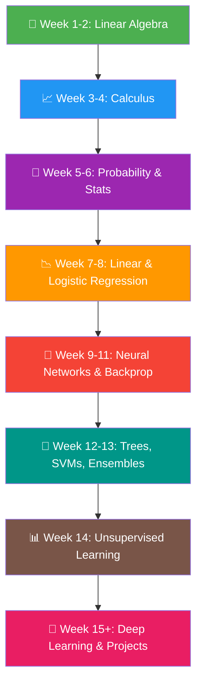

# Machine Learning with Mathematics — A Complete Guide

> [!TIP]
> This guide is designed to be read **top-to-bottom**. Each section builds on the previous one. Bookmark it and come back as you learn!

---

## Part 1: Mathematical Prerequisites

Before diving into ML, you need four pillars of math. Here's what you need from each, and *why*.

---

### 1.1 Linear Algebra — The Language of Data

**Why?** All data in ML is represented as vectors and matrices. Every image, sentence, and table becomes a matrix of numbers.

#### Key Concepts

| Concept | What It Means in ML |
|---|---|
| **Scalar** | A single number (e.g., a person's age = `25`) |
| **Vector** | A list of numbers — one data point (e.g., `[age, height, weight]` = `[25, 170, 68]`) |
| **Matrix** | A table of numbers — your whole dataset. Each row = one sample, each column = one feature |
| **Tensor** | A multi-dimensional array (used in deep learning — images are 3D tensors: height × width × color channels) |

#### Operations You Must Know

**Dot Product** — Measures similarity between two vectors:

```
a · b = a₁b₁ + a₂b₂ + ... + aₙbₙ = Σ aᵢbᵢ
```

> This is the **single most important operation in ML**. A neuron in a neural network computes a dot product. Linear regression computes a dot product. SVMs use dot products.

**Matrix Multiplication** — Apply transformations to entire datasets at once:

```
If A is (m × n) and B is (n × p), then C = A × B is (m × p)
where Cᵢⱼ = Σₖ Aᵢₖ × Bₖⱼ
```

**Transpose** — Flip rows and columns:
```
If A is (m × n), then Aᵀ is (n × m)
```

**Inverse** — "Undo" a matrix transformation:
```
A × A⁻¹ = I  (identity matrix)
```

Used in closed-form solutions like the Normal Equation for linear regression.

**Eigenvalues & Eigenvectors** — Find the "principal directions" of data:
```
Av = λv

where v is the eigenvector (direction) and λ is the eigenvalue (magnitude/importance)
```

> Used in **PCA** (dimensionality reduction) — finding the directions of maximum variance in your data.

---

### 1.2 Calculus — How Models Learn

**Why?** ML models learn by minimizing a **loss function**. Calculus tells us *how to change parameters to reduce the loss*.

#### Key Concepts

**Derivative** — The rate of change (slope) of a function:
```
f'(x) = lim(h→0) [f(x+h) - f(x)] / h
```

**Partial Derivative** — Derivative with respect to one variable while keeping others fixed:
```
∂f/∂x   means "how does f change when I nudge x, keeping y constant?"
```

> Every ML model has many parameters. Partial derivatives tell us how the loss changes with respect to **each** parameter individually.

**Gradient** — A vector of all partial derivatives:
```
∇f = [∂f/∂x₁, ∂f/∂x₂, ..., ∂f/∂xₙ]
```

> The gradient **points in the direction of steepest increase**. To minimize loss, we go in the **opposite** direction. This is **Gradient Descent**!

**Chain Rule** — The backbone of backpropagation:
```
If y = f(g(x)), then dy/dx = f'(g(x)) × g'(x)

Or in notation: ∂L/∂w = (∂L/∂ŷ) × (∂ŷ/∂z) × (∂z/∂w)
```

> Neural networks are **nested functions**. The chain rule lets us compute how the final loss relates to weights deep inside the network.

---

### 1.3 Probability — Dealing with Uncertainty

**Why?** The real world is noisy. Probability lets us make predictions *with confidence levels* and handle uncertainty.

#### Key Concepts

**Probability Basics:**
```
P(A) ∈ [0, 1]          — probability is between 0 and 1
P(A) + P(not A) = 1    — something either happens or doesn't
P(A and B) = P(A) × P(B)   — if A and B are independent
```

**Conditional Probability:**
```
P(A|B) = P(A and B) / P(B)

"The probability of A, given that B happened"
```

> Example: What's the probability an email is spam, given that it contains the word "free"?

**Bayes' Theorem** — Update beliefs with new evidence:
```
P(A|B) = P(B|A) × P(A) / P(B)

posterior = (likelihood × prior) / evidence
```

> The foundation of **Naive Bayes classifiers**, Bayesian optimization, and probabilistic ML.

**Probability Distributions:**

| Distribution | Use Case |
|---|---|
| **Gaussian (Normal)** `N(μ, σ²)` | Most common; models natural phenomena, errors, noise |
| **Bernoulli** | Binary outcomes (spam/not spam, click/no click) |
| **Multinomial** | Multiple categories (classifying into 10 digits) |
| **Uniform** | Equal probability for all outcomes |

**The Gaussian (Normal) Distribution:**
```
f(x) = (1 / √(2πσ²)) × exp(-(x - μ)² / 2σ²)

μ = mean (center)
σ² = variance (spread)
```

---

### 1.4 Statistics — Summarizing & Understanding Data

**Why?** Before building models, you need to understand your data.

#### Key Concepts

| Concept | Formula | Meaning |
|---|---|---|
| **Mean** | μ = (1/n) Σ xᵢ | Average value |
| **Variance** | σ² = (1/n) Σ (xᵢ - μ)² | How spread out the data is |
| **Standard Deviation** | σ = √(σ²) | Spread in original units |
| **Covariance** | cov(X,Y) = (1/n) Σ (xᵢ-μₓ)(yᵢ-μᵧ) | Do X and Y move together? |
| **Correlation** | r = cov(X,Y) / (σₓ × σᵧ) | Normalized covariance [-1, 1] |

**Maximum Likelihood Estimation (MLE):**

> Given data, find the parameters that make the data *most probable*.

```
θ̂ = argmax P(Data | θ)

In practice, we maximize the log-likelihood (easier math):
θ̂ = argmax Σ log P(xᵢ | θ)
```

> MLE is how we derive the loss functions for logistic regression, neural networks, and more!

---

## Part 2: Core ML Algorithms with Math

Now let's build ML algorithms from scratch, using the math above.

---

### 2.1 Linear Regression — Predicting Continuous Values

**Goal:** Find a line (or hyperplane) that best fits the data.

**Model:**
```
ŷ = w₁x₁ + w₂x₂ + ... + wₙxₙ + b

In vector form: ŷ = wᵀx + b

Where:
  w = weight vector (parameters to learn)
  b = bias (intercept)
  x = input features
  ŷ = prediction
```

**Loss Function — Mean Squared Error (MSE):**
```
L(w, b) = (1/2m) Σᵢ (ŷᵢ - yᵢ)²

Where m = number of training examples
```

> Why squared? (1) Always positive. (2) Penalizes large errors more. (3) Differentiable everywhere.

**Learning via Gradient Descent:**

Compute the gradients:
```
∂L/∂wⱼ = (1/m) Σᵢ (ŷᵢ - yᵢ) × xᵢⱼ
∂L/∂b  = (1/m) Σᵢ (ŷᵢ - yᵢ)
```

Update the parameters:
```
wⱼ ← wⱼ - α × ∂L/∂wⱼ
b  ← b  - α × ∂L/∂b

Where α = learning rate (a small positive number like 0.01)
```

> **Intuition:** If the prediction is too high (ŷ > y), the gradient is positive, so we *decrease* w. If too low, we *increase* it. Repeat until convergence!

**Closed-Form Solution — Normal Equation:**
```
w = (XᵀX)⁻¹Xᵀy
```

> No iteration needed! But requires matrix inversion — expensive for large datasets (O(n³)).

---

### 2.2 Logistic Regression — Binary Classification

**Goal:** Predict a probability P(y=1|x) for binary outcomes.

**Why not just use linear regression?** Because linear regression outputs any real number, but we need a probability between 0 and 1.

**The Sigmoid Function — Squashing to [0, 1]:**
```
σ(z) = 1 / (1 + e⁻ᶻ)

Properties:
  σ(0)  = 0.5
  σ(∞)  = 1
  σ(-∞) = 0
  σ'(z) = σ(z)(1 - σ(z))   ← beautiful derivative!
```

**Model:**
```
z = wᵀx + b              ← linear part
ŷ = σ(z) = 1/(1+e⁻ᶻ)    ← squash to probability
```

**Loss Function — Binary Cross-Entropy:**

Derived from MLE on Bernoulli distribution:
```
L = -(1/m) Σ [yᵢ log(ŷᵢ) + (1-yᵢ) log(1-ŷᵢ)]
```

> **Intuition:**
> - If true label y=1 and we predict ŷ≈1 → log(1) ≈ 0 → low loss ✓
> - If true label y=1 and we predict ŷ≈0 → log(0) → ∞ → high loss ✗ (big penalty!)

**Gradient (same form as linear regression!):**
```
∂L/∂wⱼ = (1/m) Σ (ŷᵢ - yᵢ) × xᵢⱼ
```

**Decision Boundary:**
```
Predict class 1 if ŷ ≥ 0.5, i.e., if wᵀx + b ≥ 0
Predict class 0 otherwise
```

---

### 2.3 Neural Networks — Learning Any Function

**Key Insight:** A neural network is just **nested logistic regressions** with nonlinear activations.

#### Architecture

```
Input Layer    →    Hidden Layer(s)    →    Output Layer
   x                   h = σ(W₁x + b₁)        ŷ = σ(W₂h + b₂)
```

**One Neuron:**
```
output = activation(Σ wᵢxᵢ + b) = activation(wᵀx + b)
```

**Layer of Neurons (vectorized):**
```
h = activation(Wx + b)

Where:
  W = weight matrix (each row = one neuron's weights)
  b = bias vector
  h = output vector of the layer
```

#### Activation Functions

| Function | Formula | Derivative | When to Use |
|---|---|---|---|
| **Sigmoid** | σ(z) = 1/(1+e⁻ᶻ) | σ(z)(1-σ(z)) | Output layer (binary) |
| **Tanh** | tanh(z) = (eᶻ-e⁻ᶻ)/(eᶻ+e⁻ᶻ) | 1 - tanh²(z) | Hidden layers (centered) |
| **ReLU** | max(0, z) | 0 if z<0, 1 if z>0 | **Default for hidden layers** |
| **Softmax** | eᶻⁱ / Σⱼ eᶻʲ | (complex) | Output layer (multi-class) |

> **Why ReLU?** Sigmoid/tanh squash gradients toward 0 for large |z| → **vanishing gradient problem**. ReLU keeps gradients alive for positive values.

#### Backpropagation — How Neural Networks Learn

It's just the **chain rule** applied layer by layer, from output back to input.

**Forward Pass (compute predictions):**
```
z₁ = W₁x + b₁        ← linear transform
h₁ = ReLU(z₁)         ← activation
z₂ = W₂h₁ + b₂       ← linear transform  
ŷ  = σ(z₂)            ← final output
L  = loss(ŷ, y)       ← compute loss
```

**Backward Pass (compute gradients via chain rule):**
```
∂L/∂z₂ = ŷ - y                             ← output gradient
∂L/∂W₂ = (∂L/∂z₂) × h₁ᵀ                   ← gradient for W₂
∂L/∂b₂ = ∂L/∂z₂                            ← gradient for b₂

∂L/∂h₁ = W₂ᵀ × (∂L/∂z₂)                   ← propagate back
∂L/∂z₁ = (∂L/∂h₁) ⊙ ReLU'(z₁)             ← element-wise multiply with activation derivative
∂L/∂W₁ = (∂L/∂z₁) × xᵀ                    ← gradient for W₁
∂L/∂b₁ = ∂L/∂z₁                            ← gradient for b₁
```

**Update all weights:**
```
W₁ ← W₁ - α × ∂L/∂W₁
b₁ ← b₁ - α × ∂L/∂b₁
W₂ ← W₂ - α × ∂L/∂W₂
b₂ ← b₂ - α × ∂L/∂b₂
```

> **Universal Approximation Theorem:** A neural network with *at least one hidden layer* and nonlinear activation can approximate *any continuous function* to arbitrary accuracy, given enough neurons.

---

### 2.4 Regularization — Preventing Overfitting

**Problem:** A model that memorizes training data but fails on new data.

**Mathematically, we add a penalty term to the loss:**

**L2 Regularization (Ridge):**
```
L_total = L_original + (λ/2m) Σ wⱼ²
```
> Pushes weights toward zero but never exactly zero. Smooth, differentiable.

**L1 Regularization (Lasso):**
```
L_total = L_original + (λ/m) Σ |wⱼ|
```
> Can push weights to **exactly zero** → feature selection!

**λ (lambda)** is the regularization strength:
- λ = 0 → no regularization (may overfit)
- λ = ∞ → all weights → 0 (may underfit)
- Sweet spot → found via cross-validation

---

### 2.5 Support Vector Machine (SVM) — Maximum Margin Classifier

**Goal:** Find the hyperplane that separates classes with the **largest margin**.

**Decision Boundary:**
```
wᵀx + b = 0       ← the hyperplane

Classify as +1 if wᵀx + b > 0
Classify as -1 if wᵀx + b < 0
```

**Margin:**
```
margin = 2 / ‖w‖

Where ‖w‖ = √(Σ wⱼ²) is the norm of w
```

**Optimization Problem:**
```
Minimize:    (1/2) ‖w‖²
Subject to:  yᵢ(wᵀxᵢ + b) ≥ 1  for all i
```

> **Intuition:** Minimize ‖w‖² = maximize margin, while ensuring all points are on the correct side.

**The Kernel Trick — Handling Non-linear Data:**

Map data to higher dimensions where it *becomes* linearly separable:
```
K(xᵢ, xⱼ) = φ(xᵢ) · φ(xⱼ)
```

Common kernels:
| Kernel | Formula |
|---|---|
| Linear | xᵢᵀxⱼ |
| Polynomial | (xᵢᵀxⱼ + c)ᵈ |
| **RBF (Gaussian)** | exp(-γ ‖xᵢ - xⱼ‖²) |

> The kernel trick lets us compute dot products in high-dimensional space **without actually transforming the data**!

---

### 2.6 Decision Trees & Ensemble Methods

**Decision Trees** split data by asking yes/no questions about features.

**How to choose the best split?**

**Entropy (Information Theory):**
```
H(S) = -Σ pᵢ log₂(pᵢ)

Where pᵢ = proportion of class i in set S
```
- H = 0 → perfectly pure (all one class)
- H = 1 → maximum impurity (50/50 split for binary)

**Information Gain:**
```
IG(S, feature) = H(S) - Σ (|Sᵥ|/|S|) × H(Sᵥ)

Choose the feature with the highest Information Gain
```

**Gini Impurity (used in CART):**
```
Gini(S) = 1 - Σ pᵢ²
```

#### Random Forest

- Build many decision trees on random subsets of data & features
- Each tree votes; majority wins
- **Mathematically:** reduces variance by averaging independent estimators

```
Var(average of n trees) = σ² / n   (if trees are independent)
```

#### Gradient Boosting

- Build trees **sequentially**, each correcting the errors of the previous
- At each step, fit a tree to the **negative gradient** of the loss:

```
rᵢ = -∂L(yᵢ, F(xᵢ))/∂F(xᵢ)    ← pseudo-residuals

F_{m+1}(x) = Fₘ(x) + α × hₘ(x)

Where hₘ is a tree fit to the pseudo-residuals rᵢ
```

---

### 2.7 K-Means Clustering — Unsupervised Learning

**Goal:** Group data into K clusters without labels.

**Algorithm:**
```
1. Initialize K cluster centroids μ₁, μ₂, ..., μₖ randomly
2. Repeat until convergence:
   a. ASSIGN each point to nearest centroid:
      cᵢ = argminₖ ‖xᵢ - μₖ‖²
   
   b. UPDATE centroids to mean of assigned points:
      μₖ = (1/|Cₖ|) Σ_{xᵢ ∈ Cₖ} xᵢ
```

**Objective — Minimize within-cluster sum of squares:**
```
J = Σₖ Σ_{xᵢ ∈ Cₖ} ‖xᵢ - μₖ‖²
```

---

### 2.8 PCA — Dimensionality Reduction

**Goal:** Reduce the number of features while keeping maximum information (variance).

**Steps:**
```
1. Center the data:   X̃ = X - μ
2. Compute covariance matrix:   C = (1/m) X̃ᵀX̃
3. Compute eigenvectors/eigenvalues of C:   Cv = λv
4. Sort eigenvectors by eigenvalue (largest first)
5. Project data onto top k eigenvectors:   Z = X̃ × Vₖ
```

**Variance explained by component i:**
```
Explained ratio = λᵢ / Σⱼ λⱼ
```

> Choose k such that you retain 95%+ of the total variance.

---

## Part 3: Optimization Deep Dive

### 3.1 Gradient Descent Variants

| Variant | Update Rule | Pros/Cons |
|---|---|---|
| **Batch GD** | Use ALL training data per step | Stable but slow |
| **Stochastic GD** | Use ONE random sample per step | Noisy but fast |
| **Mini-batch GD** | Use a batch of B samples per step | **Best of both** |

### 3.2 Advanced Optimizers

**Momentum** — Accelerate through flat regions:
```
vₜ = β × vₜ₋₁ + (1-β) × ∇L
w ← w - α × vₜ
```

**Adam** (Adaptive Moment Estimation) — **Most popular optimizer**:
```
mₜ = β₁ × mₜ₋₁ + (1-β₁) × ∇L           ← 1st moment (mean)
vₜ = β₂ × vₜ₋₁ + (1-β₂) × (∇L)²        ← 2nd moment (variance)
m̂ₜ = mₜ / (1-β₁ᵗ)                        ← bias correction
v̂ₜ = vₜ / (1-β₂ᵗ)                        ← bias correction
w ← w - α × m̂ₜ / (√v̂ₜ + ε)
```

---

## Part 4: Evaluation Metrics

### Classification

| Metric | Formula | When to Use |
|---|---|---|
| **Accuracy** | (TP+TN) / (TP+TN+FP+FN) | Balanced classes |
| **Precision** | TP / (TP+FP) | When false positives are costly |
| **Recall** | TP / (TP+FN) | When false negatives are costly |
| **F1 Score** | 2 × (P×R) / (P+R) | Imbalanced classes |

### Regression

| Metric | Formula |
|---|---|
| **MSE** | (1/m) Σ (ŷᵢ - yᵢ)² |
| **RMSE** | √MSE |
| **MAE** | (1/m) Σ \|ŷᵢ - yᵢ\| |
| **R² Score** | 1 - (Σ(yᵢ-ŷᵢ)²) / (Σ(yᵢ-ȳ)²) |

---

## Part 5: The Bias-Variance Tradeoff

The **fundamental concept** of ML generalization.

```
Total Error = Bias² + Variance + Irreducible Noise
```

| | High Bias | High Variance |
|---|---|---|
| **Problem** | Underfitting | Overfitting |
| **Training Error** | High | Low |
| **Test Error** | High | High |
| **Model** | Too simple | Too complex |
| **Fix** | More features, bigger model | More data, regularization |

---

## Part 6: Recommended Learning Roadmap



### Recommended Resources

| Topic | Resource | Type |
|---|---|---|
| Linear Algebra | 3Blue1Brown — *Essence of Linear Algebra* | Video |
| Calculus | 3Blue1Brown — *Essence of Calculus* | Video |
| Probability | Khan Academy — Probability & Statistics | Video |
| ML Theory | Andrew Ng — Stanford CS229 | Course |
| Deep Learning | *Deep Learning* by Goodfellow, Bengio, Courville | Book (free) |
| Hands-on | *Hands-On ML* by Aurélien Géron | Book |
| Practice | Kaggle Competitions | Platform |

---

> [!IMPORTANT]
> **The #1 tip**: Don't just read the math — **implement it from scratch in Python/NumPy** before using libraries like scikit-learn or PyTorch. You'll understand 10x better by coding each algorithm yourself.
